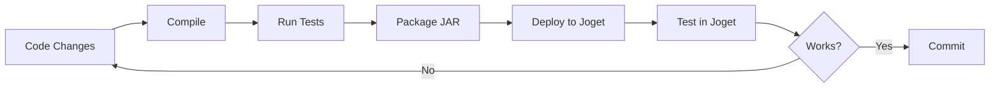

# Joget DX8 Plugin Development - Complete Setup and Workflow Guide

## Table of Contents

1. [Development Environment Setup](#development-environment-setup)
2. [Project Setup and Structure](#project-setup-and-structure)
3. [Maven Configuration](#maven-configuration)
4. [IDE Configuration](#ide-configuration)
5. [OSGi and Bundle Development](#osgi-and-bundle-development)
6. [Development Workflow](#development-workflow)
7. [Building and Packaging](#building-and-packaging)
8. [Testing Strategies](#testing-strategies)
9. [Debugging Techniques](#debugging-techniques)
10. [Deployment Process](#deployment-process)
11. [Hot Deployment and Live Reload](#hot-deployment-and-live-reload)
12. [Version Management](#version-management)
13. [Continuous Integration](#continuous-integration)
14. [Performance Optimization](#performance-optimization)
15. [Troubleshooting Guide](#troubleshooting-guide)
16. [Best Practices](#best-practices)

---

## Development Environment Setup

### Prerequisites

#### Required Software

| Software | Minimum Version | Recommended Version | Purpose |
|----------|-----------------|-------------------|---------|
| **Java JDK** | 11 | 11 or 17 | Runtime and compilation |
| **Maven** | 3.6.0 | 3.8.x or higher | Build management |
| **IDE** | Any Java IDE | IntelliJ IDEA 2023.x | Development |
| **Git** | 2.x | Latest | Version control |
| **Joget Server** | DX8 | DX8 Enterprise | Testing environment |

#### Verification Commands

```bash
# Verify Java installation
java -version
# Expected output: openjdk version "11.0.x" or higher

# Verify Maven installation
mvn -version
# Expected output: Apache Maven 3.6.x or higher

# Verify Git installation
git --version
# Expected output: git version 2.x.x

# Set JAVA_HOME environment variable
export JAVA_HOME=/path/to/jdk11
export PATH=$JAVA_HOME/bin:$PATH
```

### Setting Up Joget Server

#### Option 1: Local Installation

```bash
# Download Joget DX8
wget https://download.joget.org/enterprise/joget-dx8-enterprise.tar.gz

# Extract
tar -xzf joget-dx8-enterprise.tar.gz

# Start Joget
cd joget-dx8-enterprise
./joget-start.sh

# Access Joget
# URL: http://localhost:8080/jw
# Default login: admin/admin
```

#### Option 2: Docker Installation

```bash
# Pull Joget Docker image
docker pull jogetworkflow/joget-dx8-enterprise

# Run Joget container
docker run -d \
  --name joget-dx8 \
  -p 8080:8080 \
  -v $(pwd)/wflow:/opt/joget/wflow \
  jogetworkflow/joget-dx8-enterprise

# Check container status
docker ps

# View logs
docker logs -f joget-dx8
```

#### Option 3: Development Server Setup

```bash
# Clone Joget for development
git clone https://github.com/jogetworkflow/jw-community.git
cd jw-community

# Build from source
mvn clean install -DskipTests

# Run embedded server
cd wflow-app
mvn jetty:run
```

### Directory Structure for Development

```
~/joget-development/
├── workspace/              # Your plugin projects
│   ├── my-plugin-1/
│   ├── my-plugin-2/
│   └── shared-libs/
├── joget-server/          # Joget installation
│   ├── apache-tomcat/
│   ├── wflow/
│   │   ├── app_plugins/   # Plugin deployment directory
│   │   └── app_src/       # Application sources
│   └── logs/
├── tools/                 # Development tools
│   ├── maven-settings.xml
│   └── scripts/
└── documentation/         # Your documentation
```

---

## Project Setup and Structure

### Creating a New Plugin Project

#### Step 1: Generate Project Structure

```bash
# Create project directory
mkdir my-joget-plugin
cd my-joget-plugin

# Create Maven structure
mkdir -p src/main/java/com/company/joget/plugin/{lib,util,model}
mkdir -p src/main/resources/{META-INF,properties,templates,messages}
mkdir -p src/test/java/com/company/joget/plugin
mkdir -p src/test/resources

# Create initial files
touch pom.xml
touch src/main/java/com/company/joget/plugin/Activator.java
touch README.md
touch .gitignore
```

#### Step 2: Standard Project Structure

```
my-joget-plugin/
├── pom.xml                                    # Maven configuration
├── README.md                                  # Documentation
├── .gitignore                                 # Git ignore file
├── src/
│   ├── main/
│   │   ├── java/
│   │   │   └── com/company/joget/plugin/
│   │   │       ├── Activator.java            # OSGi Bundle Activator
│   │   │       ├── lib/                      # Plugin implementations
│   │   │       │   ├── MyProcessTool.java
│   │   │       │   ├── MyFormElement.java
│   │   │       │   └── MyHashVariable.java
│   │   │       ├── util/                     # Utility classes
│   │   │       │   ├── DatabaseUtil.java
│   │   │       │   └── ApiClient.java
│   │   │       └── model/                    # Data models
│   │   │           └── ConfigModel.java
│   │   └── resources/
│   │       ├── META-INF/
│   │       │   └── services/                 # Service declarations
│   │       ├── properties/                   # Plugin properties JSON
│   │       │   ├── myProcessTool.json
│   │       │   └── myFormElement.json
│   │       ├── templates/                    # FreeMarker templates
│   │       │   └── formElement.ftl
│   │       └── messages/                     # i18n resource bundles
│   │           ├── myPlugin.properties
│   │           └── myPlugin_es.properties
│   └── test/
│       ├── java/                              # Unit tests
│       │   └── com/company/joget/plugin/
│       │       └── MyProcessToolTest.java
│       └── resources/                        # Test resources
│           └── test-data.json
└── target/                                    # Build output (generated)
    ├── classes/
    └── my-joget-plugin-1.0.0.jar
```

### Project Files Templates

#### .gitignore

```gitignore
# Build outputs
target/
*.jar
*.war
*.ear

# IDE files
.idea/
*.iml
.classpath
.project
.settings/
.vscode/

# OS files
.DS_Store
Thumbs.db

# Log files
*.log

# Temporary files
*.tmp
*.bak
*.swp
*~

# Maven
dependency-reduced-pom.xml
```

#### README.md Template

```markdown
# My Joget Plugin

## Description
Brief description of what this plugin does.

## Features
- Feature 1
- Feature 2
- Feature 3

## Requirements
- Joget DX8 Enterprise Edition
- Java 11+

## Installation
1. Build the plugin: `mvn clean package`
2. Copy JAR to Joget: `cp target/*.jar /path/to/joget/wflow/app_plugins/`
3. Restart Joget server

## Configuration
Document plugin configuration options here.

## Development
### Building
```bash
mvn clean package
```

### Testing
```bash
mvn test
```

## License
Your license here
```

---

## Maven Configuration

### Complete pom.xml Template

```xml
<?xml version="1.0" encoding="UTF-8"?>
<project xmlns="http://maven.apache.org/POM/4.0.0"
         xmlns:xsi="http://www.w3.org/2001/XMLSchema-instance"
         xsi:schemaLocation="http://maven.apache.org/POM/4.0.0 
         http://maven.apache.org/maven-v4_0_0.xsd">
    
    <modelVersion>4.0.0</modelVersion>
    
    <!-- Project Information -->
    <groupId>com.company.joget</groupId>
    <artifactId>my-joget-plugin</artifactId>
    <version>1.0.0-SNAPSHOT</version>
    <packaging>bundle</packaging>
    <name>My Joget Plugin</name>
    <description>Custom Joget DX8 Plugin</description>
    
    <!-- Properties -->
    <properties>
        <project.build.sourceEncoding>UTF-8</project.build.sourceEncoding>
        <maven.compiler.source>11</maven.compiler.source>
        <maven.compiler.target>11</maven.compiler.target>
        <joget.version>8.0-SNAPSHOT</joget.version>
        <junit.version>5.9.2</junit.version>
        <mockito.version>5.1.1</mockito.version>
    </properties>
    
    <!-- Repositories -->
    <repositories>
        <!-- Maven Central -->
        <repository>
            <id>central</id>
            <url>https://repo.maven.apache.org/maven2</url>
        </repository>
        
        <!-- Joget Repository -->
        <repository>
            <id>joget-internal</id>
            <url>https://dev.joget.org/archiva/repository/internal</url>
        </repository>
        
        <!-- Joget Snapshots -->
        <repository>
            <id>joget-snapshots</id>
            <url>https://dev.joget.org/archiva/repository/snapshots</url>
            <snapshots>
                <enabled>true</enabled>
            </snapshots>
        </repository>
    </repositories>
    
    <!-- Dependencies -->
    <dependencies>
        <!-- Core Joget Dependencies -->
        <dependency>
            <groupId>org.joget</groupId>
            <artifactId>wflow-core</artifactId>
            <version>${joget.version}</version>
            <scope>provided</scope>
        </dependency>
        
        <dependency>
            <groupId>org.joget</groupId>
            <artifactId>wflow-plugin-base</artifactId>
            <version>${joget.version}</version>
            <scope>provided</scope>
        </dependency>
        
        <dependency>
            <groupId>org.joget</groupId>
            <artifactId>wflow-commons</artifactId>
            <version>${joget.version}</version>
            <scope>provided</scope>
        </dependency>
        
        <!-- Workflow Engine -->
        <dependency>
            <groupId>org.joget</groupId>
            <artifactId>wflow-wfengine</artifactId>
            <version>${joget.version}</version>
            <scope>provided</scope>
        </dependency>
        
        <!-- Directory Services -->
        <dependency>
            <groupId>org.joget</groupId>
            <artifactId>wflow-directory</artifactId>
            <version>${joget.version}</version>
            <scope>provided</scope>
        </dependency>
        
        <!-- Servlet API -->
        <dependency>
            <groupId>javax.servlet</groupId>
            <artifactId>javax.servlet-api</artifactId>
            <version>4.0.1</version>
            <scope>provided</scope>
        </dependency>
        
        <!-- Logging -->
        <dependency>
            <groupId>org.slf4j</groupId>
            <artifactId>slf4j-api</artifactId>
            <version>1.7.36</version>
            <scope>provided</scope>
        </dependency>
        
        <!-- Apache Commons (if needed) -->
        <dependency>
            <groupId>commons-io</groupId>
            <artifactId>commons-io</artifactId>
            <version>2.11.0</version>
        </dependency>
        
        <dependency>
            <groupId>org.apache.commons</groupId>
            <artifactId>commons-lang3</artifactId>
            <version>3.12.0</version>
        </dependency>
        
        <!-- JSON Processing -->
        <dependency>
            <groupId>org.json</groupId>
            <artifactId>json</artifactId>
            <version>20230227</version>
        </dependency>
        
        <!-- HTTP Client (if needed) -->
        <dependency>
            <groupId>org.apache.httpcomponents</groupId>
            <artifactId>httpclient</artifactId>
            <version>4.5.14</version>
        </dependency>
        
        <!-- Testing Dependencies -->
        <dependency>
            <groupId>org.junit.jupiter</groupId>
            <artifactId>junit-jupiter</artifactId>
            <version>${junit.version}</version>
            <scope>test</scope>
        </dependency>
        
        <dependency>
            <groupId>org.mockito</groupId>
            <artifactId>mockito-core</artifactId>
            <version>${mockito.version}</version>
            <scope>test</scope>
        </dependency>
        
        <dependency>
            <groupId>org.assertj</groupId>
            <artifactId>assertj-core</artifactId>
            <version>3.24.2</version>
            <scope>test</scope>
        </dependency>
    </dependencies>
    
    <!-- Build Configuration -->
    <build>
        <plugins>
            <!-- Compiler Plugin -->
            <plugin>
                <groupId>org.apache.maven.plugins</groupId>
                <artifactId>maven-compiler-plugin</artifactId>
                <version>3.11.0</version>
                <configuration>
                    <source>${maven.compiler.source}</source>
                    <target>${maven.compiler.target}</target>
                    <encoding>${project.build.sourceEncoding}</encoding>
                </configuration>
            </plugin>
            
            <!-- Felix Bundle Plugin for OSGi -->
            <plugin>
                <groupId>org.apache.felix</groupId>
                <artifactId>maven-bundle-plugin</artifactId>
                <version>5.1.8</version>
                <extensions>true</extensions>
                <configuration>
                    <instructions>
                        <!-- Bundle Activator -->
                        <Bundle-Activator>
                            com.company.joget.plugin.Activator
                        </Bundle-Activator>
                        
                        <!-- Export packages -->
                        <Export-Package>
                            com.company.joget.plugin.lib.*
                        </Export-Package>
                        
                        <!-- Import packages -->
                        <Import-Package>
                            !com.company.joget.plugin.*,
                            org.joget.*,
                            javax.servlet.*,
                            org.apache.commons.lang3.*,
                            org.json.*,
                            *;resolution:=optional
                        </Import-Package>
                        
                        <!-- Embed dependencies -->
                        <Embed-Dependency>
                            commons-io,
                            commons-lang3,
                            json,
                            httpclient;scope=compile
                        </Embed-Dependency>
                        
                        <!-- Bundle classpath -->
                        <Bundle-ClassPath>.</Bundle-ClassPath>
                        
                        <!-- Dynamic imports for runtime -->
                        <DynamicImport-Package>*</DynamicImport-Package>
                        
                        <!-- Bundle metadata -->
                        <Bundle-Name>${project.name}</Bundle-Name>
                        <Bundle-Description>${project.description}</Bundle-Description>
                        <Bundle-Version>${project.version}</Bundle-Version>
                        <Bundle-Vendor>Your Company</Bundle-Vendor>
                        <Bundle-DocURL>https://your-docs.com</Bundle-DocURL>
                    </instructions>
                </configuration>
            </plugin>
            
            <!-- Surefire Plugin for Testing -->
            <plugin>
                <groupId>org.apache.maven.plugins</groupId>
                <artifactId>maven-surefire-plugin</artifactId>
                <version>3.0.0-M9</version>
                <configuration>
                    <includes>
                        <include>**/*Test.java</include>
                        <include>**/*Tests.java</include>
                    </includes>
                </configuration>
            </plugin>
            
            <!-- Resources Plugin -->
            <plugin>
                <groupId>org.apache.maven.plugins</groupId>
                <artifactId>maven-resources-plugin</artifactId>
                <version>3.3.0</version>
                <configuration>
                    <encoding>${project.build.sourceEncoding}</encoding>
                </configuration>
            </plugin>
            
            <!-- Source Plugin (for debugging) -->
            <plugin>
                <groupId>org.apache.maven.plugins</groupId>
                <artifactId>maven-source-plugin</artifactId>
                <version>3.2.1</version>
                <executions>
                    <execution>
                        <id>attach-sources</id>
                        <goals>
                            <goal>jar</goal>
                        </goals>
                    </execution>
                </executions>
            </plugin>
        </plugins>
    </build>
    
    <!-- Profiles for different environments -->
    <profiles>
        <!-- Development Profile -->
        <profile>
            <id>dev</id>
            <activation>
                <activeByDefault>true</activeByDefault>
            </activation>
            <properties>
                <build.profile>dev</build.profile>
            </properties>
        </profile>
        
        <!-- Production Profile -->
        <profile>
            <id>prod</id>
            <properties>
                <build.profile>prod</build.profile>
            </properties>
            <build>
                <plugins>
                    <plugin>
                        <groupId>org.apache.maven.plugins</groupId>
                        <artifactId>maven-compiler-plugin</artifactId>
                        <configuration>
                            <optimize>true</optimize>
                            <debug>false</debug>
                        </configuration>
                    </plugin>
                </plugins>
            </build>
        </profile>
    </profiles>
</project>
```

### Maven Settings Configuration

Create `~/.m2/settings.xml`:

```xml
<settings xmlns="http://maven.apache.org/SETTINGS/1.0.0">
    <servers>
        <!-- Joget Repository Authentication (if required) -->
        <server>
            <id>joget-internal</id>
            <username>your-username</username>
            <password>your-password</password>
        </server>
    </servers>
    
    <profiles>
        <profile>
            <id>joget-dev</id>
            <repositories>
                <repository>
                    <id>joget-internal</id>
                    <url>https://dev.joget.org/archiva/repository/internal</url>
                </repository>
            </repositories>
        </profile>
    </profiles>
    
    <activeProfiles>
        <activeProfile>joget-dev</activeProfile>
    </activeProfiles>
</settings>
```

---

## IDE Configuration

### IntelliJ IDEA Setup

#### Step 1: Import Project

```
1. File → Open → Select pom.xml
2. Choose "Open as Project"
3. Select "Trust Project" if prompted
4. Wait for indexing to complete
```

#### Step 2: Configure Maven

```
1. File → Settings → Build, Execution, Deployment → Build Tools → Maven
2. Set Maven home directory
3. Set User settings file to your settings.xml
4. Check "Always update snapshots"
```

#### Step 3: Configure JDK

```
1. File → Project Structure → Project
2. Set Project SDK to Java 11
3. Set Project language level to 11
```

#### Step 4: Enable Annotation Processing

```
1. File → Settings → Build, Execution, Deployment → Compiler → Annotation Processors
2. Check "Enable annotation processing"
```

#### Step 5: Configure Run/Debug

Create `.idea/runConfigurations/Deploy_Plugin.xml`:

```xml
<component name="ProjectRunConfigurationManager">
  <configuration default="false" name="Deploy Plugin" type="ShellScriptRunConfigurationType">
    <option name="SCRIPT_TEXT" value="mvn clean package &amp;&amp; cp target/*.jar /path/to/joget/wflow/app_plugins/" />
    <option name="INDEPENDENT_SCRIPT_PATH" value="true" />
    <option name="SCRIPT_PATH" value="" />
    <option name="SCRIPT_OPTIONS" value="" />
    <option name="INDEPENDENT_SCRIPT_WORKING_DIRECTORY" value="true" />
    <option name="SCRIPT_WORKING_DIRECTORY" value="$PROJECT_DIR$" />
    <method v="2" />
  </configuration>
</component>
```

### Eclipse Setup

#### Step 1: Import Project

```
1. File → Import → Maven → Existing Maven Projects
2. Browse to project directory
3. Select pom.xml
4. Click Finish
```

#### Step 2: Configure Build Path

```
1. Right-click project → Properties → Java Build Path
2. Set JRE System Library to Java 11
3. Order and Export tab → Check Maven Dependencies
```

#### Step 3: Configure Maven

```
1. Right-click project → Properties → Maven
2. Check "Resolve dependencies from Workspace projects"
3. Active Maven Profiles: dev
```

### Visual Studio Code Setup

#### Required Extensions

```json
{
  "recommendations": [
    "vscjava.vscode-java-pack",
    "vscjava.vscode-maven",
    "vscjava.vscode-java-debug",
    "vscjava.vscode-java-test",
    "redhat.java",
    "redhat.vscode-xml"
  ]
}
```

#### settings.json

```json
{
  "java.configuration.updateBuildConfiguration": "automatic",
  "java.home": "/path/to/jdk11",
  "maven.executable.path": "/path/to/maven/bin/mvn",
  "java.configuration.maven.userSettings": "~/.m2/settings.xml",
  "java.compile.nullAnalysis.mode": "automatic",
  "java.configuration.runtimes": [
    {
      "name": "JavaSE-11",
      "path": "/path/to/jdk11",
      "default": true
    }
  ]
}
```

---

## OSGi and Bundle Development

### Understanding OSGi in Joget

#### OSGi Bundle Lifecycle

```
INSTALLED → RESOLVED → STARTING → ACTIVE → STOPPING → UNINSTALLED
```

### Bundle Activator Implementation

```java
package com.company.joget.plugin;

import org.osgi.framework.BundleActivator;
import org.osgi.framework.BundleContext;
import org.osgi.framework.ServiceRegistration;
import org.joget.commons.util.LogUtil;
import java.util.ArrayList;
import java.util.Collection;

public class Activator implements BundleActivator {
    
    protected Collection<ServiceRegistration> registrationList;
    private static BundleContext bundleContext;
    
    @Override
    public void start(BundleContext context) throws Exception {
        bundleContext = context;
        registrationList = new ArrayList<>();
        
        try {
            // Register Process Tool Plugin
            registrationList.add(context.registerService(
                com.company.joget.plugin.lib.MyProcessTool.class.getName(),
                new com.company.joget.plugin.lib.MyProcessTool(),
                null
            ));
            
            // Register Form Element Plugin
            registrationList.add(context.registerService(
                com.company.joget.plugin.lib.MyFormElement.class.getName(),
                new com.company.joget.plugin.lib.MyFormElement(),
                null
            ));
            
            // Register Hash Variable Plugin
            registrationList.add(context.registerService(
                com.company.joget.plugin.lib.MyHashVariable.class.getName(),
                new com.company.joget.plugin.lib.MyHashVariable(),
                null
            ));
            
            LogUtil.info(getClass().getName(), 
                "Plugin bundle started successfully");
            
        } catch (Exception e) {
            LogUtil.error(getClass().getName(), e, 
                "Failed to start plugin bundle");
            throw e;
        }
    }
    
    @Override
    public void stop(BundleContext context) throws Exception {
        try {
            // Unregister all services
            if (registrationList != null) {
                for (ServiceRegistration registration : registrationList) {
                    registration.unregister();
                }
            }
            
            LogUtil.info(getClass().getName(), 
                "Plugin bundle stopped successfully");
            
        } catch (Exception e) {
            LogUtil.error(getClass().getName(), e, 
                "Error stopping plugin bundle");
        } finally {
            bundleContext = null;
        }
    }
    
    public static BundleContext getBundleContext() {
        return bundleContext;
    }
}
```

### OSGi Service Management

```java
// Service registration with properties
Dictionary<String, String> props = new Hashtable<>();
props.put("plugin.name", "MyPlugin");
props.put("plugin.version", "1.0.0");

ServiceRegistration registration = context.registerService(
    MyPlugin.class.getName(),
    new MyPlugin(),
    props
);

// Service tracking
ServiceTracker tracker = new ServiceTracker(
    context, 
    MyService.class.getName(), 
    null
);
tracker.open();
MyService service = (MyService) tracker.getService();
```

---

## Development Workflow

### Standard Development Cycle



### Development Scripts

#### build-and-deploy.sh

```bash
#!/bin/bash

# Configuration
PROJECT_DIR="$(pwd)"
JOGET_PLUGINS="/path/to/joget/wflow/app_plugins"
PLUGIN_NAME="my-joget-plugin"
VERSION="1.0.0-SNAPSHOT"

# Colors for output
RED='\033[0;31m'
GREEN='\033[0;32m'
YELLOW='\033[1;33m'
NC='\033[0m' # No Color

echo -e "${YELLOW}Building plugin...${NC}"

# Clean and build
mvn clean package

if [ $? -eq 0 ]; then
    echo -e "${GREEN}Build successful!${NC}"
    
    # Copy to Joget
    echo -e "${YELLOW}Deploying to Joget...${NC}"
    cp target/${PLUGIN_NAME}-${VERSION}.jar ${JOGET_PLUGINS}/
    
    if [ $? -eq 0 ]; then
        echo -e "${GREEN}Deployment successful!${NC}"
        echo -e "${YELLOW}Plugin deployed to: ${JOGET_PLUGINS}${NC}"
        
        # Optional: Restart Joget
        read -p "Restart Joget server? (y/n) " -n 1 -r
        echo
        if [[ $REPLY =~ ^[Yy]$ ]]; then
            /path/to/joget/joget-stop.sh
            sleep 2
            /path/to/joget/joget-start.sh
            echo -e "${GREEN}Joget restarted!${NC}"
        fi
    else
        echo -e "${RED}Deployment failed!${NC}"
        exit 1
    fi
else
    echo -e "${RED}Build failed!${NC}"
    exit 1
fi
```

#### watch-and-deploy.sh

```bash
#!/bin/bash

# Watch for changes and auto-deploy
while true; do
    inotifywait -r -e modify,create,delete src/
    echo "Changes detected, rebuilding..."
    ./build-and-deploy.sh
done
```

### Git Workflow

#### .gitignore for Joget Projects

```gitignore
# Build
target/
*.jar
*.war

# IDE
.idea/
*.iml
.classpath
.project
.settings/
.vscode/
*.swp
*.swo

# OS
.DS_Store
Thumbs.db

# Logs
*.log
logs/

# Temp
*.tmp
*.bak
*~

# Maven
dependency-reduced-pom.xml
pom.xml.versionsBackup
```

#### Branch Strategy

```bash
# Main branches
main          # Production-ready code
develop       # Development branch

# Feature branches
feature/JIRA-123-new-process-tool
feature/JIRA-456-form-validator

# Release branches
release/1.0.0
release/1.1.0

# Hotfix branches
hotfix/JIRA-789-critical-bug
```

---

## Building and Packaging

### Maven Build Commands

```bash
# Clean build
mvn clean

# Compile only
mvn compile

# Run tests
mvn test

# Package without tests
mvn package -DskipTests

# Full build with tests
mvn clean package

# Install to local repository
mvn install

# Generate sources JAR
mvn source:jar

# Generate Javadoc
mvn javadoc:jar

# Full release build
mvn clean package source:jar javadoc:jar

# Build with specific profile
mvn clean package -Pprod

# Update dependencies
mvn dependency:resolve

# Check for dependency updates
mvn versions:display-dependency-updates

# Analyze dependencies
mvn dependency:analyze
```

### Build Optimization

#### Parallel Builds

```bash
# Use multiple CPU cores
mvn -T 4 clean package

# Or use 1 thread per CPU core
mvn -T 1C clean package
```

#### Incremental Builds

```xml
<plugin>
    <groupId>org.apache.maven.plugins</groupId>
    <artifactId>maven-compiler-plugin</artifactId>
    <configuration>
        <useIncrementalCompilation>true</useIncrementalCompilation>
    </configuration>
</plugin>
```

---

## Testing Strategies

### Unit Testing

#### Basic Test Structure

```java
package com.company.joget.plugin;

import org.junit.jupiter.api.*;
import org.mockito.Mock;
import org.mockito.MockitoAnnotations;
import static org.assertj.core.api.Assertions.*;
import static org.mockito.Mockito.*;

class MyProcessToolTest {
    
    @Mock
    private WorkflowAssignment mockAssignment;
    
    private MyProcessTool plugin;
    
    @BeforeEach
    void setUp() {
        MockitoAnnotations.openMocks(this);
        plugin = new MyProcessTool();
    }
    
    @Test
    @DisplayName("Should execute successfully with valid input")
    void testExecuteSuccess() {
        // Given
        Map<String, Object> properties = new HashMap<>();
        properties.put("workflowAssignment", mockAssignment);
        
        when(mockAssignment.getProcessId()).thenReturn("process123");
        when(mockAssignment.getActivityId()).thenReturn("activity456");
        
        // When
        Object result = plugin.execute(properties);
        
        // Then
        assertThat(result).isNotNull();
        assertThat(result.toString()).contains("Success");
        verify(mockAssignment, times(1)).getProcessId();
    }
    
    @Test
    @DisplayName("Should handle null assignment gracefully")
    void testExecuteWithNullAssignment() {
        // Given
        Map<String, Object> properties = new HashMap<>();
        properties.put("workflowAssignment", null);
        
        // When
        Object result = plugin.execute(properties);
        
        // Then
        assertThat(result).isNotNull();
        assertThat(result.toString()).contains("No workflow assignment");
    }
    
    @Test
    @DisplayName("Should validate required properties")
    void testPropertyValidation() {
        // Given
        Map<String, Object> properties = new HashMap<>();
        properties.put("apiUrl", "");
        
        // When/Then
        assertThatThrownBy(() -> plugin.setProperties(properties))
            .isInstanceOf(IllegalArgumentException.class)
            .hasMessageContaining("API URL is required");
    }
}
```

### Integration Testing

```java
@TestInstance(TestInstance.Lifecycle.PER_CLASS)
class PluginIntegrationTest {
    
    private static Joget joget;
    
    @BeforeAll
    static void setUpJoget() {
        // Start embedded Joget for testing
        joget = JogetTestRunner.start();
    }
    
    @AfterAll
    static void tearDownJoget() {
        joget.stop();
    }
    
    @Test
    void testPluginInWorkflow() {
        // Create test workflow
        String processId = joget.deployProcess("test-process.xpdl");
        
        // Start process instance
        String instanceId = joget.startProcess(processId);
        
        // Verify plugin execution
        WorkflowActivity activity = joget.getActivity(instanceId, "plugin-activity");
        assertThat(activity.getStatus()).isEqualTo("COMPLETED");
    }
}
```

### Test Data Management

#### Test Resources Structure

```
src/test/resources/
├── test-data/
│   ├── sample-form.json
│   ├── test-workflow.xpdl
│   └── mock-responses.json
├── test.properties
└── logback-test.xml
```

#### Loading Test Data

```java
public class TestDataLoader {
    
    public static String loadJson(String filename) throws IOException {
        InputStream stream = TestDataLoader.class
            .getResourceAsStream("/test-data/" + filename);
        return IOUtils.toString(stream, StandardCharsets.UTF_8);
    }
    
    public static FormRowSet loadFormData(String filename) throws Exception {
        String json = loadJson(filename);
        return FormUtil.jsonToFormRowSet(json);
    }
}
```

---

## Debugging Techniques

### Remote Debugging

#### Configure Joget for Remote Debugging

Edit `joget-start.sh` or `setenv.sh`:

```bash
# Add debug options
export JAVA_OPTS="$JAVA_OPTS -Xdebug -Xrunjdwp:transport=dt_socket,server=y,suspend=n,address=*:5005"
```

#### IntelliJ Remote Debug Configuration

```
1. Run → Edit Configurations → Add New → Remote JVM Debug
2. Host: localhost
3. Port: 5005
4. Use module classpath: your-plugin
5. Click OK
```

### Logging and Monitoring

#### Comprehensive Logging

```java
import org.joget.commons.util.LogUtil;

public class MyPlugin extends DefaultApplicationPlugin {
    
    private static final String CLASS_NAME = MyPlugin.class.getName();
    
    @Override
    public Object execute(Map properties) {
        // Debug level - detailed information
        LogUtil.debug(CLASS_NAME, "Starting plugin execution");
        LogUtil.debug(CLASS_NAME, "Properties: " + properties);
        
        try {
            // Info level - important events
            LogUtil.info(CLASS_NAME, "Processing request for user: " + getCurrentUser());
            
            // Your logic here
            String result = processData();
            
            // Info level - successful completion
            LogUtil.info(CLASS_NAME, "Successfully processed: " + result);
            
            return result;
            
        } catch (ValidationException e) {
            // Warn level - recoverable issues
            LogUtil.warn(CLASS_NAME, "Validation failed: " + e.getMessage());
            return "Validation error: " + e.getMessage();
            
        } catch (Exception e) {
            // Error level - serious problems
            LogUtil.error(CLASS_NAME, e, "Fatal error in plugin execution");
            return "Error: " + e.getMessage();
        }
    }
    
    private void traceMethodCall(String methodName, Object... params) {
        if (LogUtil.isDebugEnabled(CLASS_NAME)) {
            LogUtil.debug(CLASS_NAME, String.format(
                "Method: %s, Params: %s", 
                methodName, 
                Arrays.toString(params)
            ));
        }
    }
}
```

#### Custom Log Configuration

Create `src/main/resources/logback.xml`:

```xml
<configuration>
    <appender name="CONSOLE" class="ch.qos.logback.core.ConsoleAppender">
        <encoder>
            <pattern>%d{HH:mm:ss.SSS} [%thread] %-5level %logger{36} - %msg%n</pattern>
        </encoder>
    </appender>
    
    <appender name="FILE" class="ch.qos.logback.core.FileAppender">
        <file>logs/plugin.log</file>
        <encoder>
            <pattern>%d{yyyy-MM-dd HH:mm:ss.SSS} [%thread] %-5level %logger - %msg%n</pattern>
        </encoder>
    </appender>
    
    <!-- Plugin-specific logging -->
    <logger name="com.company.joget.plugin" level="DEBUG"/>
    
    <!-- Joget framework logging -->
    <logger name="org.joget" level="INFO"/>
    
    <root level="INFO">
        <appender-ref ref="CONSOLE"/>
        <appender-ref ref="FILE"/>
    </root>
</configuration>
```

### Performance Profiling

```java
public class PerformanceMonitor {
    
    public static <T> T measureTime(String operation, Supplier<T> task) {
        long startTime = System.currentTimeMillis();
        
        try {
            T result = task.get();
            long duration = System.currentTimeMillis() - startTime;
            
            LogUtil.info(PerformanceMonitor.class.getName(), 
                String.format("Operation '%s' completed in %d ms", 
                    operation, duration));
            
            if (duration > 1000) {
                LogUtil.warn(PerformanceMonitor.class.getName(),
                    String.format("Slow operation detected: '%s' took %d ms", 
                        operation, duration));
            }
            
            return result;
            
        } catch (Exception e) {
            long duration = System.currentTimeMillis() - startTime;
            LogUtil.error(PerformanceMonitor.class.getName(), e,
                String.format("Operation '%s' failed after %d ms", 
                    operation, duration));
            throw e;
        }
    }
}

// Usage
String result = PerformanceMonitor.measureTime("Database Query", 
    () -> performDatabaseQuery());
```

---

## Deployment Process

### Manual Deployment

```bash
# Step 1: Build the plugin
mvn clean package

# Step 2: Copy to Joget
cp target/my-plugin-1.0.0.jar /path/to/joget/wflow/app_plugins/

# Step 3: Verify deployment
ls -la /path/to/joget/wflow/app_plugins/ | grep my-plugin

# Step 4: Check Joget logs
tail -f /path/to/joget/logs/joget.log

# Step 5: Restart if needed (for major changes)
/path/to/joget/joget-stop.sh
/path/to/joget/joget-start.sh
```

### Automated Deployment

#### deploy.sh Script

```bash
#!/bin/bash

# Configuration
PLUGIN_JAR="target/my-plugin-1.0.0.jar"
JOGET_HOST="localhost"
JOGET_PORT="8080"
JOGET_USER="admin"
JOGET_PASS="admin"
JOGET_PLUGINS="/opt/joget/wflow/app_plugins"

# Function to check if Joget is running
check_joget() {
    curl -s -o /dev/null -w "%{http_code}" \
        http://${JOGET_HOST}:${JOGET_PORT}/jw/web/json/plugin/list
}

# Function to upload plugin via API
upload_plugin() {
    curl -X POST \
        -u ${JOGET_USER}:${JOGET_PASS} \
        -F "pluginFile=@${PLUGIN_JAR}" \
        http://${JOGET_HOST}:${JOGET_PORT}/jw/web/json/plugin/upload
}

# Main deployment
echo "Starting deployment..."

# Build plugin
echo "Building plugin..."
mvn clean package

if [ $? -ne 0 ]; then
    echo "Build failed!"
    exit 1
fi

# Check if Joget is running
echo "Checking Joget status..."
STATUS=$(check_joget)

if [ "$STATUS" == "200" ]; then
    echo "Joget is running. Uploading plugin..."
    upload_plugin
    echo "Plugin uploaded successfully!"
else
    echo "Joget is not running. Copying plugin manually..."
    cp ${PLUGIN_JAR} ${JOGET_PLUGINS}/
    echo "Plugin copied. Please start Joget."
fi

echo "Deployment complete!"
```

### Docker Deployment

```dockerfile
# Dockerfile for plugin development
FROM jogetworkflow/joget-dx8-enterprise:latest

# Copy plugin JAR
COPY target/*.jar /opt/joget/wflow/app_plugins/

# Set permissions
RUN chmod 644 /opt/joget/wflow/app_plugins/*.jar

# Start Joget
CMD ["/opt/joget/joget-start.sh"]
```

#### docker-compose.yml

```yaml
version: '3.8'

services:
  joget:
    build: .
    ports:
      - "8080:8080"
    volumes:
      - ./target:/plugin-source:ro
      - joget-data:/opt/joget/wflow
    environment:
      - JAVA_OPTS=-Xmx2048m -Xdebug -Xrunjdwp:transport=dt_socket,server=y,suspend=n,address=*:5005
    networks:
      - joget-network

  mysql:
    image: mysql:8.0
    environment:
      MYSQL_ROOT_PASSWORD: root
      MYSQL_DATABASE: jwdb
      MYSQL_USER: joget
      MYSQL_PASSWORD: joget
    volumes:
      - mysql-data:/var/lib/mysql
    networks:
      - joget-network

volumes:
  joget-data:
  mysql-data:

networks:
  joget-network:
```

---

## Hot Deployment and Live Reload

### Enabling Hot Deployment

#### Configure Joget for Hot Deployment

Edit `app_plugins.properties`:

```properties
# Enable plugin directory monitoring
plugin.directory.monitor=true
plugin.directory.monitor.interval=5000

# Enable hot deployment
plugin.hotdeploy.enabled=true
```

### File Watcher Implementation

```java
public class PluginFileWatcher {
    
    private final Path pluginDir;
    private final WatchService watchService;
    private volatile boolean running = true;
    
    public PluginFileWatcher(String pluginDirectory) throws IOException {
        this.pluginDir = Paths.get(pluginDirectory);
        this.watchService = FileSystems.getDefault().newWatchService();
        
        // Register for events
        pluginDir.register(watchService,
            StandardWatchEventKinds.ENTRY_CREATE,
            StandardWatchEventKinds.ENTRY_MODIFY,
            StandardWatchEventKinds.ENTRY_DELETE
        );
    }
    
    public void start() {
        new Thread(() -> {
            while (running) {
                try {
                    WatchKey key = watchService.take();
                    
                    for (WatchEvent<?> event : key.pollEvents()) {
                        WatchEvent.Kind<?> kind = event.kind();
                        Path filename = (Path) event.context();
                        
                        if (filename.toString().endsWith(".jar")) {
                            handlePluginChange(kind, filename);
                        }
                    }
                    
                    key.reset();
                    
                } catch (InterruptedException e) {
                    Thread.currentThread().interrupt();
                    break;
                }
            }
        }).start();
    }
    
    private void handlePluginChange(WatchEvent.Kind<?> kind, Path filename) {
        LogUtil.info(getClass().getName(), 
            "Plugin change detected: " + kind + " - " + filename);
        
        if (kind == StandardWatchEventKinds.ENTRY_CREATE ||
            kind == StandardWatchEventKinds.ENTRY_MODIFY) {
            reloadPlugin(filename);
        } else if (kind == StandardWatchEventKinds.ENTRY_DELETE) {
            unloadPlugin(filename);
        }
    }
}
```

---

## Version Management

### Semantic Versioning

```
MAJOR.MINOR.PATCH-QUALIFIER

Examples:
1.0.0           - First release
1.0.1           - Bug fix
1.1.0           - New features
2.0.0           - Breaking changes
1.0.0-SNAPSHOT  - Development version
1.0.0-RC1       - Release candidate
```

### Version Management in pom.xml

```xml
<project>
    <version>${revision}</version>
    
    <properties>
        <revision>1.0.0-SNAPSHOT</revision>
    </properties>
    
    <build>
        <plugins>
            <plugin>
                <groupId>org.codehaus.mojo</groupId>
                <artifactId>versions-maven-plugin</artifactId>
                <version>2.11.0</version>
            </plugin>
        </plugins>
    </build>
</project>
```

#### Version Commands

```bash
# Set new version
mvn versions:set -DnewVersion=1.0.1

# Commit version change
mvn versions:commit

# Revert version change
mvn versions:revert

# Update to next snapshot
mvn versions:set -DnextSnapshot=true

# Display dependency updates
mvn versions:display-dependency-updates

# Display plugin updates
mvn versions:display-plugin-updates
```

---

## Continuous Integration

### GitHub Actions CI/CD

`.github/workflows/build.yml`:

```yaml
name: Build and Test

on:
  push:
    branches: [ main, develop ]
  pull_request:
    branches: [ main ]

jobs:
  build:
    runs-on: ubuntu-latest
    
    steps:
    - uses: actions/checkout@v3
    
    - name: Set up JDK 11
      uses: actions/setup-java@v3
      with:
        java-version: '11'
        distribution: 'temurin'
    
    - name: Cache Maven dependencies
      uses: actions/cache@v3
      with:
        path: ~/.m2
        key: ${{ runner.os }}-m2-${{ hashFiles('**/pom.xml') }}
        restore-keys: ${{ runner.os }}-m2
    
    - name: Build with Maven
      run: mvn clean compile
    
    - name: Run tests
      run: mvn test
    
    - name: Package plugin
      run: mvn package
    
    - name: Upload artifact
      uses: actions/upload-artifact@v3
      with:
        name: plugin-jar
        path: target/*.jar
    
    - name: Generate test report
      uses: dorny/test-reporter@v1
      if: success() || failure()
      with:
        name: Maven Tests
        path: target/surefire-reports/*.xml
        reporter: java-junit
```

### Jenkins Pipeline

`Jenkinsfile`:

```groovy
pipeline {
    agent any
    
    tools {
        maven 'Maven-3.8.6'
        jdk 'JDK-11'
    }
    
    stages {
        stage('Checkout') {
            steps {
                checkout scm
            }
        }
        
        stage('Build') {
            steps {
                sh 'mvn clean compile'
            }
        }
        
        stage('Test') {
            steps {
                sh 'mvn test'
            }
            post {
                always {
                    junit 'target/surefire-reports/*.xml'
                }
            }
        }
        
        stage('Package') {
            steps {
                sh 'mvn package'
            }
        }
        
        stage('Deploy to Dev') {
            when {
                branch 'develop'
            }
            steps {
                sh '''
                    scp target/*.jar joget@dev-server:/opt/joget/wflow/app_plugins/
                    ssh joget@dev-server "sudo systemctl restart joget"
                '''
            }
        }
        
        stage('Deploy to Production') {
            when {
                branch 'main'
            }
            steps {
                input 'Deploy to production?'
                sh '''
                    scp target/*.jar joget@prod-server:/opt/joget/wflow/app_plugins/
                    ssh joget@prod-server "sudo systemctl restart joget"
                '''
            }
        }
    }
    
    post {
        always {
            archiveArtifacts artifacts: 'target/*.jar', fingerprint: true
            cleanWs()
        }
    }
}
```

---

## Performance Optimization

### Code Optimization

#### Caching Strategy

```java
public class CachedDataService {
    
    private static final Map<String, Object> cache = new ConcurrentHashMap<>();
    private static final long CACHE_TTL = 5 * 60 * 1000; // 5 minutes
    
    public Object getData(String key) {
        CacheEntry entry = (CacheEntry) cache.get(key);
        
        if (entry == null || entry.isExpired()) {
            Object data = loadDataFromSource(key);
            cache.put(key, new CacheEntry(data));
            return data;
        }
        
        return entry.getValue();
    }
    
    private static class CacheEntry {
        private final Object value;
        private final long timestamp;
        
        CacheEntry(Object value) {
            this.value = value;
            this.timestamp = System.currentTimeMillis();
        }
        
        boolean isExpired() {
            return System.currentTimeMillis() - timestamp > CACHE_TTL;
        }
        
        Object getValue() {
            return value;
        }
    }
}
```

#### Connection Pooling

```java
public class DatabaseConnectionPool {
    
    private static HikariDataSource dataSource;
    
    static {
        HikariConfig config = new HikariConfig();
        config.setJdbcUrl("jdbc:mysql://localhost:3306/jwdb");
        config.setUsername("joget");
        config.setPassword("joget");
        config.setMaximumPoolSize(10);
        config.setMinimumIdle(2);
        config.setConnectionTimeout(30000);
        config.setIdleTimeout(600000);
        config.setMaxLifetime(1800000);
        
        dataSource = new HikariDataSource(config);
    }
    
    public static Connection getConnection() throws SQLException {
        return dataSource.getConnection();
    }
}
```

### Memory Management

```java
public class ResourceManager {
    
    public void processLargeData() {
        // Use try-with-resources for automatic cleanup
        try (BufferedReader reader = new BufferedReader(
                new FileReader("large-file.txt"))) {
            
            // Process in chunks
            String line;
            int batchSize = 0;
            List<String> batch = new ArrayList<>(1000);
            
            while ((line = reader.readLine()) != null) {
                batch.add(line);
                batchSize++;
                
                if (batchSize >= 1000) {
                    processBatch(batch);
                    batch.clear();
                    batchSize = 0;
                }
            }
            
            // Process remaining
            if (!batch.isEmpty()) {
                processBatch(batch);
            }
            
        } catch (IOException e) {
            LogUtil.error(getClass().getName(), e, "Error processing file");
        }
    }
}
```

---

## Troubleshooting Guide

### Common Issues and Solutions

#### Issue: Plugin Not Loading

**Symptoms:**
- Plugin JAR in directory but not appearing in Joget
- No errors in logs

**Solutions:**

```bash
# 1. Check file permissions
ls -la /path/to/joget/wflow/app_plugins/

# 2. Verify JAR is valid
jar -tf my-plugin.jar | head

# 3. Check MANIFEST.MF
jar -xf my-plugin.jar META-INF/MANIFEST.MF
cat META-INF/MANIFEST.MF

# 4. Look for bundle errors
grep -i "bundle\|osgi" /path/to/joget/logs/joget.log

# 5. Verify Activator class exists
jar -tf my-plugin.jar | grep Activator
```

#### Issue: ClassNotFoundException

**Symptoms:**
- Plugin loads but throws class not found errors

**Solutions:**

```xml
<!-- Fix Import-Package in pom.xml -->
<Import-Package>
    !com.company.joget.plugin.*,
    org.joget.*,
    javax.servlet.*,
    *;resolution:=optional
</Import-Package>

<!-- Embed required dependencies -->
<Embed-Dependency>
    commons-io,
    commons-lang3;scope=compile
</Embed-Dependency>
```

#### Issue: Properties Not Saving

**Symptoms:**
- Configuration changes don't persist

**Debug Code:**

```java
@Override
public void setProperties(Map<String, Object> properties) {
    // Debug logging
    LogUtil.info(getClass().getName(), 
        "Setting properties: " + properties);
    
    super.setProperties(properties);
    
    // Verify properties are set
    LogUtil.info(getClass().getName(), 
        "Properties after setting: " + getProperties());
}
```

### Diagnostic Tools

#### Plugin Health Check

```java
public class PluginHealthCheck {
    
    public static void diagnose(Plugin plugin) {
        System.out.println("=== Plugin Diagnostics ===");
        System.out.println("Name: " + plugin.getName());
        System.out.println("Version: " + plugin.getVersion());
        System.out.println("Class: " + plugin.getClass().getName());
        
        // Check dependencies
        try {
            Class.forName("org.joget.apps.app.service.AppUtil");
            System.out.println("✓ Joget core classes available");
        } catch (ClassNotFoundException e) {
            System.out.println("✗ Joget core classes not found");
        }
        
        // Check properties
        if (plugin instanceof PropertyEditable) {
            PropertyEditable pe = (PropertyEditable) plugin;
            System.out.println("Properties: " + pe.getProperties());
        }
        
        // Test execution
        try {
            Object result = plugin.execute(new HashMap<>());
            System.out.println("✓ Execution successful: " + result);
        } catch (Exception e) {
            System.out.println("✗ Execution failed: " + e.getMessage());
        }
    }
}
```

---

## Best Practices

### Code Quality

#### 1. Follow Java Conventions

```java
// Good naming
public class EmailNotificationPlugin { }  // PascalCase for classes
private String emailAddress;              // camelCase for variables
public static final int MAX_RETRIES = 3;  // UPPER_CASE for constants

// Clear method names
public void sendEmail() { }               // Verb for actions
public boolean isValid() { }              // is/has for boolean
public String getEmailAddress() { }       // get/set for properties
```

#### 2. Error Handling

```java
public Object execute(Map properties) {
    // Validate input
    if (properties == null) {
        return "Error: No properties provided";
    }
    
    try {
        // Business logic with specific exception handling
        return processData(properties);
        
    } catch (ValidationException e) {
        // Handle expected exceptions
        LogUtil.warn(getClass().getName(), 
            "Validation failed: " + e.getMessage());
        return "Validation error: " + e.getMessage();
        
    } catch (Exception e) {
        // Handle unexpected exceptions
        LogUtil.error(getClass().getName(), e, 
            "Unexpected error in plugin");
        return "An error occurred. Please check the logs.";
    }
}
```

#### 3. Resource Management

```java
// Always use try-with-resources
try (Connection conn = getConnection();
     PreparedStatement stmt = conn.prepareStatement(sql)) {
    
    // Use connection
    
} catch (SQLException e) {
    // Handle exception
}

// Clean up in finally blocks when necessary
InputStream stream = null;
try {
    stream = getResourceAsStream(filename);
    // Use stream
} finally {
    IOUtils.closeQuietly(stream);
}
```

### Security

#### 1. Input Validation

```java
public void setApiUrl(String url) {
    // Validate URL format
    if (url == null || url.trim().isEmpty()) {
        throw new IllegalArgumentException("URL cannot be empty");
    }
    
    try {
        new URL(url); // Validates URL format
    } catch (MalformedURLException e) {
        throw new IllegalArgumentException("Invalid URL format", e);
    }
    
    // Additional validation
    if (!url.startsWith("https://")) {
        throw new IllegalArgumentException("Only HTTPS URLs are allowed");
    }
    
    this.apiUrl = url;
}
```

#### 2. SQL Injection Prevention

```java
// Never concatenate SQL
// BAD:
String sql = "SELECT * FROM users WHERE id = " + userId;

// GOOD: Use parameterized queries
String sql = "SELECT * FROM users WHERE id = ?";
try (PreparedStatement stmt = conn.prepareStatement(sql)) {
    stmt.setString(1, userId);
    ResultSet rs = stmt.executeQuery();
}
```

#### 3. Sensitive Data Protection

```java
public class SecurePlugin extends DefaultApplicationPlugin {
    
    @Override
    public String getPropertyOptions() {
        return "[{" +
            "\"properties\": [{" +
                "\"name\": \"apiKey\"," +
                "\"label\": \"API Key\"," +
                "\"type\": \"password\"," +  // Use password type
                "\"required\": \"true\"" +
            "}]" +
        "}]";
    }
    
    @Override
    public Object execute(Map properties) {
        String apiKey = getPropertyString("apiKey");
        
        // Never log sensitive data
        LogUtil.info(getClass().getName(), 
            "Using API key: " + maskApiKey(apiKey));
        
        return null;
    }
    
    private String maskApiKey(String apiKey) {
        if (apiKey == null || apiKey.length() < 8) {
            return "****";
        }
        return apiKey.substring(0, 4) + "****";
    }
}
```

### Documentation

#### JavaDoc Standards

```java
/**
 * Process customer orders and send notifications.
 * 
 * This plugin integrates with the order management system to:
 * <ul>
 *   <li>Validate order data</li>
 *   <li>Process payments</li>
 *   <li>Send confirmation emails</li>
 * </ul>
 * 
 * @author Your Name
 * @version 1.0.0
 * @since 2024-01-01
 */
public class OrderProcessingPlugin extends DefaultApplicationPlugin {
    
    /**
     * Processes an order with the given parameters.
     * 
     * @param properties Map containing:
     *        - workflowAssignment: The workflow context
     *        - orderId: The order to process
     *        - customerEmail: Customer's email address
     * @return Success message or error description
     * @throws ProcessingException if order cannot be processed
     */
    @Override
    public Object execute(Map properties) throws ProcessingException {
        // Implementation
    }
}
```

---

## Conclusion

This comprehensive guide covers all aspects of Joget DX8 plugin development setup and workflow. Key takeaways:

1. **Environment Setup**: Proper Java, Maven, and IDE configuration is crucial
2. **Project Structure**: Follow standard Maven structure with OSGi bundle configuration
3. **Development Workflow**: Use automated scripts and tools for efficiency
4. **Testing**: Implement comprehensive unit and integration tests
5. **Debugging**: Use remote debugging and extensive logging
6. **Deployment**: Automate deployment with scripts and CI/CD
7. **Performance**: Optimize with caching, pooling, and efficient resource management
8. **Best Practices**: Follow Java conventions, handle errors properly, ensure security

Remember to:
- Start with a working template
- Test incrementally
- Use version control
- Document your code
- Monitor performance
- Keep security in mind

With this guide, you have everything needed to set up a professional Joget plugin development environment and workflow.